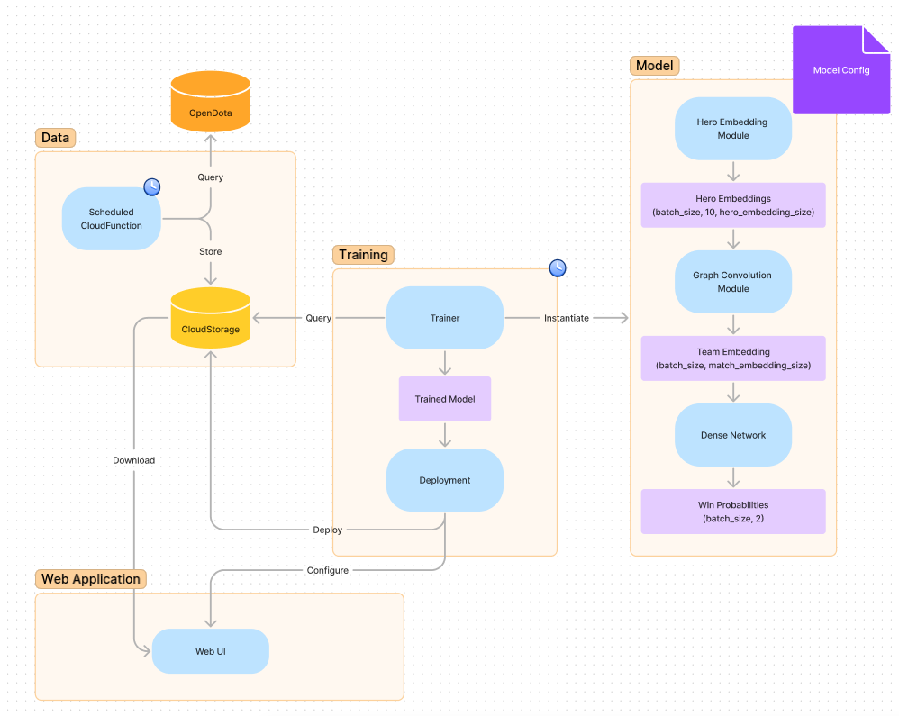

# dota-draft

ML Application for drafting heroes in the Dota 2 game.

## Data Source
[OpenDota API](https://www.opendota.com/) is scraped to retrieve match ids along with the teams' drafts and outcome.

## Technologies used

- Google Cloud Dataflow
- Google Cloud Function
- Google Cloud AI Platform

## Workflow Summary

1. Collect DOTA match IDs from the OpenDota API
2. Process match IDs to retrieve the hero drafts and match outcome
3. Train a model to predict the outcome of a match given the draft
4. Use the trained model to suggest heroes in an web UI

## Architecture Diagram

